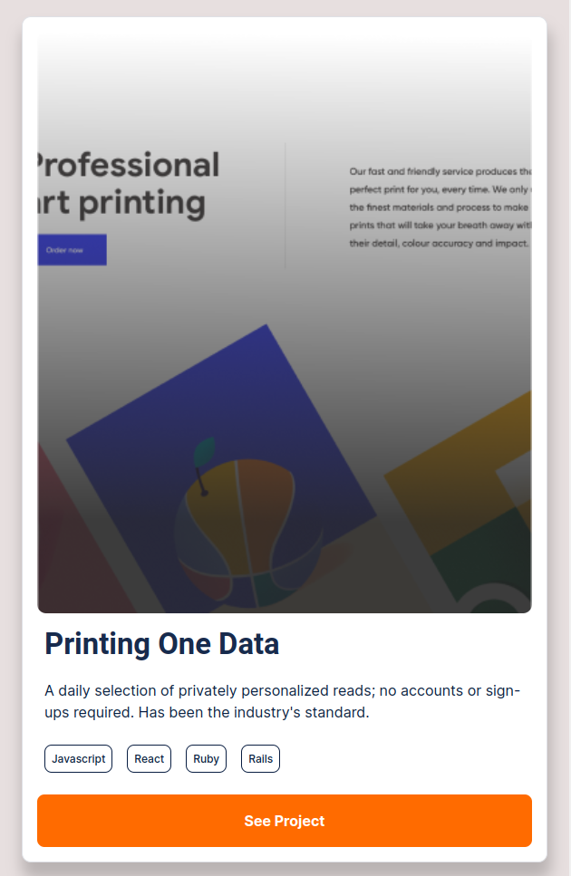

My Portfolio is responsive to different sizes of devices, with some of my recent works.
And the popUps are also responsive depending on different screens.

# Portfolio: Mobile version





# Portfolio: Desktop version


## Built With

- HTML5 & CSS
- Best Practices
- Git & Git-Flow
- Linters
- Flexbox and CSS Grid Layout
- Positioning
- JavaScript
- Git & GitFlow

## Live Demo

- [Github Link](https://github.com/Have-Samuel/my-Portifolio)
- [Live Link](https://my-portifolio-git-dev-have-samuel.vercel.app/)

## Getting Started

To get a local copy up and running follow these simple example steps.

### Prerequisites

Have Git  installed correctly.

### setup

open the terminal and install the copy of the repository.

### Install

Use the commad below to get a copy:

```
git clone git@github.com:Have-Samuel/portfolio1.git
```

## Authors

👤 **Have-Samuel**

- [Github](https://github.com/Have-Samuel)
- [FrontendMentor](https://www.frontendmentor.io/profile/Have-Samuel)
- [Twitter](https://twitter.com/samhave1)
- [LinkedIn](https://www.linkedin.com/in/have-samuel/)

## 🤝 Contributing

- Thanks to .[#Microverse](https://www.microverse.org/)
- Contributions, issues, and feature requests are welcome!

Feel free to check the [issues page](https://github.com/Have-Samuel/my-Portifolio/issues).

## Show your support

Give a ⭐️ if you like this project!

## Acknowledgments

- Thanks Microverse for the guidlines.

## 📝 License

This project is [MIT](./MIT.md) licensed.
