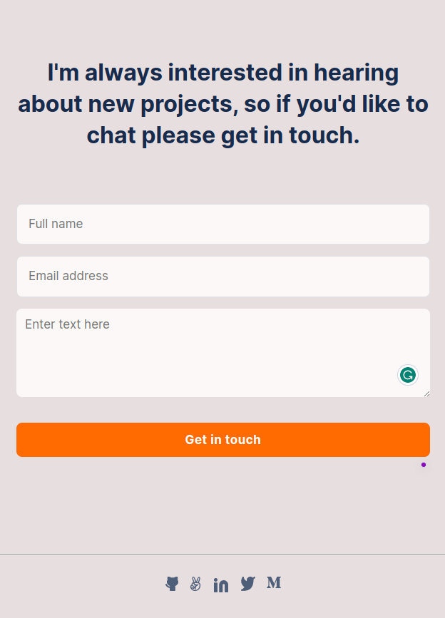
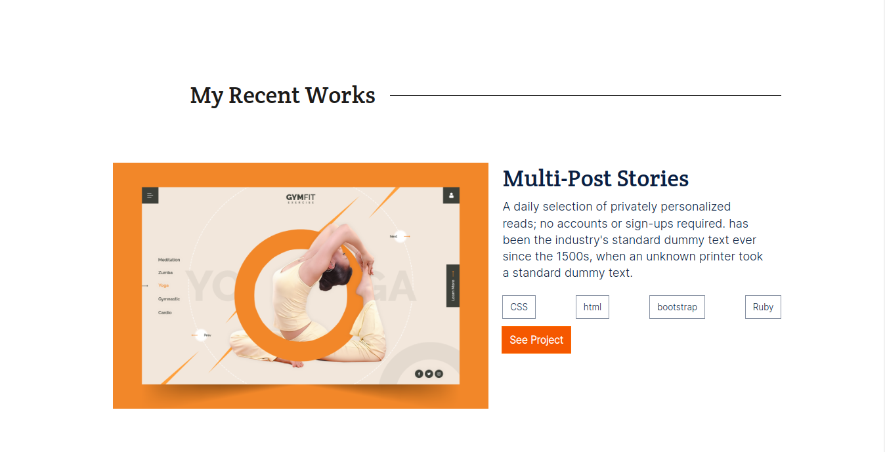
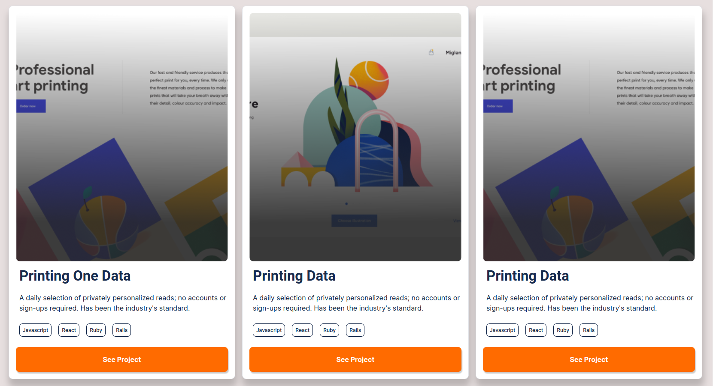

My Portfolio is responsive to different sizes of devices, with some of my recent works.

# Portfolio: Mobile version 




# Portfolio: Desktop version 

> This is my fast Portfolio page.





## Built With

- HTML5 & CSS
- Git and Git-Flow
- Linters
- Flexbox and CSS Grid Layout
- Positioning
- JavaScript
## Live Demo

[Live Link](https://my-portifolio-git-dev-have-samuel.vercel.app/)


## Getting Started

To get a local copy up and running follow these simple example steps.

### Prerequisites
Have Git  installed correctly.

### setup
open the terminal and install the copy of the repository.

### Install
Use the commad below to get a copy:
```
git clone git@github.com:Have-Samuel/portfolio1.git
```
## Authors

👤 **Have-Samuel**

- GitHub: [Have](https://github.com/Have-Samuel)
- Twitter: [samie@1](https://twitter.com/samhave1)
- LinkedIn: [Have](https://www.linkedin.com/in/have-samuel/)

## 🤝 Contributing

Contributions, issues, and feature requests are welcome!

Feel free to check the [issues page](https://github.com/Have-Samuel/my-Portifolio/issues).

## Show your support

Give a ⭐️ if you like this project!

## Acknowledgments

- Thanks Microverse for the guidlines.

## 📝 License

This project is [MIT](./MIT.md) licensed.
